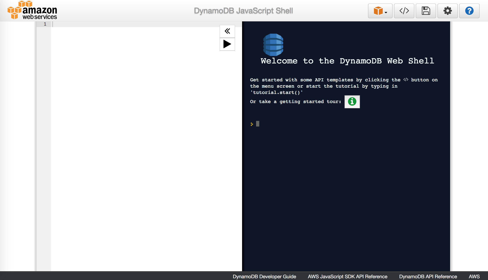

# Sambda

Simple project showing how is possible to do multiple AWS Lambdas intragration using your local enviroment.

Requirements:
* Possible to call a lambda locally using a REST API
* A Lambda may be able to call other lambda
* Integration with DynamoDB
* Use of webpack to build the Lambdas

Others:

* Possibility to execute querys on DynamoDB locally using JS


* DynamoDB Structure definition based on templates (see serverless.yml)
```
resources:
  Resources:
    SambdaDB:
      Type: 'AWS::DynamoDB::Table'
      Properties:
        AttributeDefinitions:
          -
            AttributeName: id
            AttributeType: S
        KeySchema:
          -
            AttributeName: id
            KeyType: HASH
        ProvisionedThroughput:
          ReadCapacityUnits: 1
          WriteCapacityUnits: 1
        TableName: users
```